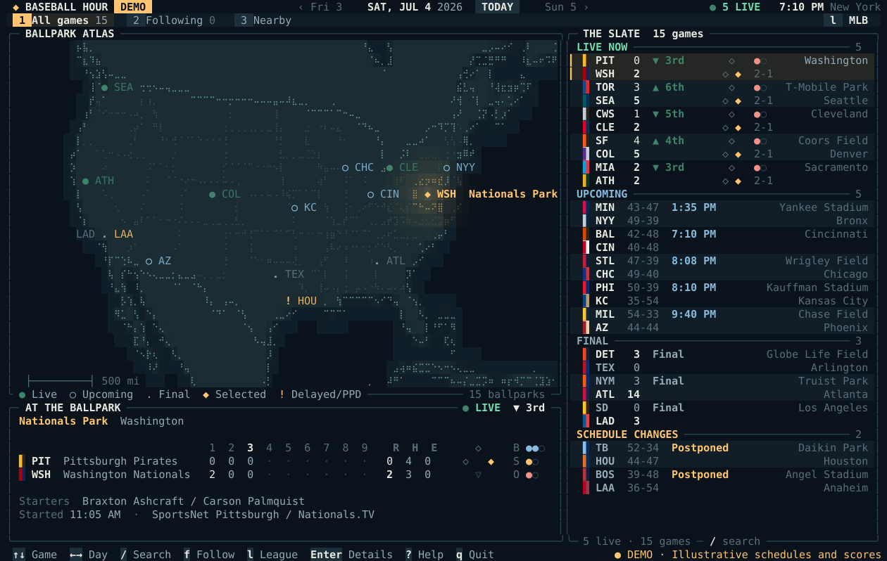
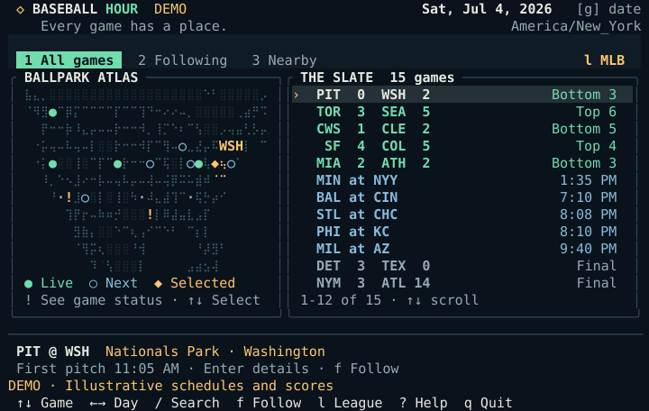
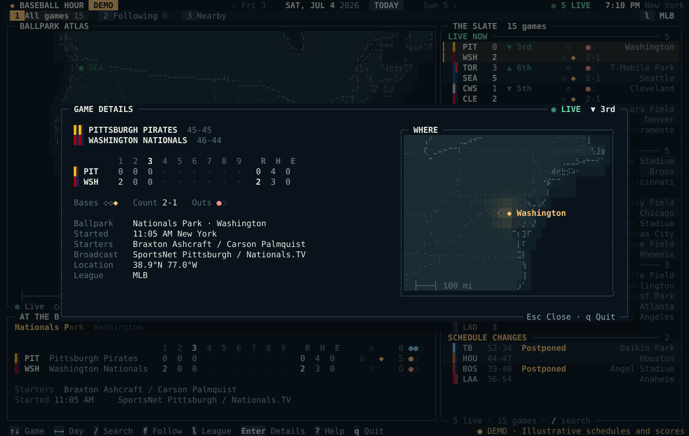

# Baseball Hour

Baseball Hour puts schedules, scores, and ballparks in your terminal. Browse the full MLB slate, follow selected teams, or sort games by distance. Switch to Triple-A, Double-A, High-A, Single-A, or all five leagues without an account or API key.



The screenshot is a 140 by 42 terminal capture from synthetic demo data.

## Install

With Node.js and npm installed, run:

```sh
npx baseballhour
```

To try the offline demo, run `npx baseballhour --demo`. To install a permanent command, run:

```sh
npm install -g baseballhour
baseballhour
```

The npm package includes precompiled binaries for macOS and Linux on Intel, AMD, and ARM64 processors. No Rust compiler, account, or API key is required.

You can also use the native installer without Node.js. It detects your operating system and processor, verifies the archive checksum, and installs the binary in `$HOME/.local/bin`.

```sh
curl -fsSLO https://raw.githubusercontent.com/justinramos101/baseballhour/main/scripts/install.sh
chmod +x install.sh
./install.sh
```

For a native installer installation, add `$HOME/.local/bin` to `PATH` if your shell cannot find `baseballhour`. The [installation guide](docs/install.md) covers npm, version pinning, custom prefixes, manual installation, and source builds.

## Take the offline tour

```sh
baseballhour --demo
```

Demo mode uses a labeled synthetic schedule and makes no network requests. For live schedules, run `baseballhour`. The app reads the public MLB StatsAPI and refreshes every 30 seconds.

## Find a game

| View | What it shows | Open it |
| --- | --- | --- |
| All games | The selected day's slate, with live games first | Press `1` |
| Following | Games that involve a team you follow | Select a game, press `f`, then press `2` |
| Nearby | Mapped ballparks ordered by straight-line distance | Press `3` and enter a city or coordinates |

Press `l` to choose MLB, one of the four full-season affiliated MiLB levels, or all leagues. Press `?` for the keyboard guide.

<details>
<summary>See the compact 80 by 24 layout</summary>



</details>

<details>
<summary>See the game details view</summary>



</details>

```sh
baseballhour --league all --near Denver
baseballhour --team Mariners --timezone America/Denver
baseballhour --offline --date 2026-07-04
baseballhour --date 2026-07-04 --json
```

Baseball Hour caches each date and league selection. If a refresh fails, the app keeps a matching saved schedule on screen with a visible `CACHED` label and its age. `--offline` prevents network requests. Nearby distances are straight-line estimates, and games without coordinates stay available outside the Nearby view.

## Documentation

- [Install Baseball Hour](docs/install.md)
- [Use Baseball Hour](docs/usage.md)
- [Architecture](docs/architecture.md)
- [Contribute](CONTRIBUTING.md)
- [Security policy](SECURITY.md)
- [Changelog](CHANGELOG.md)

Baseball Hour is available under the [MIT License](LICENSE). It is an independent project and is not affiliated with MLB or MiLB. Baseball data remains subject to its provider's terms.
