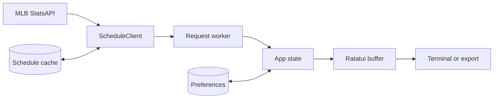

# Baseball Hour architecture

Baseball Hour keeps network access, application state, and terminal rendering in separate modules. The split lets the same state render to an interactive terminal, plain text, ANSI text, or SVG.

## Runtime data flow

1. `main.rs` builds a `Query` from the selected official date and league.
2. A background worker asks `ScheduleClient` for that query. The worker can show a matching cache entry before the network request completes.
3. `data.rs` parses the provider response into a `Snapshot`. The snapshot contains the query, fetch time, games, and warnings.
4. `App::accept` rejects a snapshot for another query. The event loop also rejects results from an older request generation.
5. `ui.rs` derives the visible list, map, details, and status line from `App` state.
6. Ratatui writes the buffer to the interactive terminal. `render.rs` writes the same buffer as plain text, ANSI text, or SVG.

The interactive loop advances `App::tick` about ten times a second while something on screen moves: the selected ballpark's ping, live markers, the loading spinner, and score-change highlights. Exports and `--once` frames render tick zero, so captures stay deterministic.

The interface is drawn in 24-bit color. When the terminal lacks truecolor, `ui::quantize` maps each frame to the xterm 256-color palette before it is written. `--ascii` replaces every remaining non-ASCII glyph in the finished frame.

The worker handles one request at a time and coalesces queued requests to the newest one. Date and league changes wait 160 milliseconds before dispatch, which limits requests during repeated navigation. A live interactive session requests a refresh 30 seconds after the previous request started, once that request is complete.

## Core data

`Query` contains an official schedule date and a `League`. The query is also the cache identity. A cache entry for another date or league cannot satisfy the request.

`Snapshot` contains normalized `Game` values. A game keeps the provider's game ID, teams, status, UTC start time, venue, optional linescore, probable pitchers, and broadcasts. Scores, times, and coordinates remain optional. The UI can then distinguish a missing value from zero.

`App` owns the current query, snapshot, selected game ID, view, input mode, search text, timezone, and preferences. All games and Following sort by game state and start time. Nearby filters games without coordinates and sorts the rest by straight-line distance.

Preferences contain followed team IDs and one explicit nearby place. Normal sessions save them in `preferences.json`. Demo sessions use empty in-memory preferences.

## Module ownership

| Module | Responsibility |
| --- | --- |
| `src/model.rs` | Schedule, team, game, venue, coordinate, and place types |
| `src/data.rs` | HTTPS requests, response parsing, cache reads and writes, and synthetic demo data |
| `src/app.rs` | Views, selection, keyboard actions, sorting, place resolution, and preferences |
| `src/ui.rs` | Responsive layouts, shared styles, navigation, and status text |
| `src/ui/atlas.rs` | Albers and azimuthal equidistant projections, land shading, braille linework, range rings, venue markers, label placement, and the legend |
| `src/ui/games.rs` | Slate sections, scoreboard cards, the scorebug, and the game details view |
| `src/ui/teams.rs` | MLB club colors for team chips |
| `src/ui/overlay.rs` | Dialogs and responsive help |
| `src/storage.rs` | Atomic file replacement for cache entries and preferences |
| `src/render.rs` | Capture of Ratatui buffers and plain, ANSI, or SVG output |
| `src/main.rs` | CLI parsing, request worker, refresh timing, and terminal setup and restoration |

## Data integrity and failure behavior

The client uses HTTPS, rejects redirects, limits the response size, and applies connection and request timeouts. Parsing validates required schedule fields and keeps valid games when individual entries are malformed.

Cache files store the raw provider response with a schema version, query, and fetch time. Writes use a new temporary file, flush it to disk, and rename it over the destination. A failed cache write produces a visible warning without discarding fresh schedule data.

When a network request fails, a matching cached snapshot remains usable and receives a `CACHED` label with its age. With no matching snapshot, the app displays the request failure. Offline mode follows the same cache path but skips the network request. Demo mode follows a separate path and always carries a synthetic-data warning.

The terminal guard restores raw mode, cursor visibility, and the alternate screen on a normal exit. A panic hook attempts the same restoration before Rust prints the panic.
